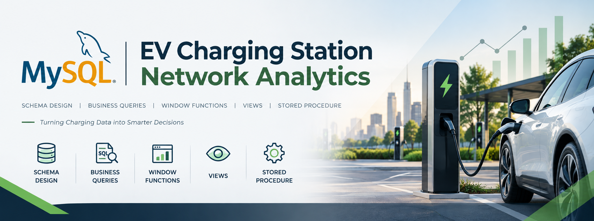

  

# EV Charging Station Network — SQL Analytics

SQL analysis of a multi-city EV charging network (stations, chargers,
customers, charging sessions, payments, and maintenance logs) using MySQL.
Modeled loosely on real operators like Tata Power and ChargeZone, with
stations across Kochi, Thiruvananthapuram, Kozhikode, and Thrissur.

## Why this project
Most SQL portfolios analyze retail/sales data. This project analyzes
**infrastructure and operations** instead — session durations, energy
consumption, equipment downtime, and station utilization — which is a
different (and much less common) analytical angle, closer to what an
analyst at an energy, IoT, or smart-mobility company would actually work on.

## Tools used
- MySQL Workbench (database design + queries)
- (Optional) Power BI — the `station_daily_utilization` view is
  dashboard-ready

## Dataset
Custom-built — see `schema/create_tables.sql` for the schema and
`data/sample_data.sql` for sample rows.

## Schema (ER overview)
customers → charging_sessions ← chargers ← stations
charging_sessions → payments
chargers → maintenance_logs

*(Add a screenshot of your actual ER diagram from MySQL Workbench here.)*

## Key business questions answered
See the `queries/` folder, organized by difficulty:
- `01_beginner_questions.sql` — filtering, sorting, basic lookups
- `02_intermediate_questions.sql` — joins, aggregates, GROUP BY/HAVING
- `03_advanced_questions.sql` — window functions, a subquery, a CTE, a view,
  and a stored procedure

A few highlights:
- Ranking stations by **utilization within each city** using `DENSE_RANK()`
- Identifying chargers with above-average downtime using a subquery
- A CTE to find each customer's most-used station
- A `station_daily_utilization` view ready to plug into a BI dashboard
- A `get_station_health()` stored procedure returning revenue + open
  maintenance issues for any station

## What I learned
Practiced modeling an operations-heavy (non-retail) domain from scratch,
writing window functions for utilization ranking, and building a reusable
view and stored procedure that a monitoring dashboard could call directly.

## How to run
1. Run `schema/create_tables.sql` to create the database and tables.
2. Run `data/sample_data.sql` to populate it.
3. Run the files in `queries/` in order, or open them individually in
   MySQL Workbench.

---

## LinkedIn post draft

Built an end-to-end SQL project analyzing an EV charging station network
across four Kerala cities, using MySQL.

Most portfolio projects analyze what people buy — I wanted to analyze
infrastructure instead.

What I did:
• Designed a 6-table relational schema (stations, chargers, customers,
  sessions, payments, maintenance logs)
• Answered 20+ business questions — from station utilization to charger
  downtime to peak charging hours
• Used window functions, a CTE, a view, and a stored procedure to go
  beyond basic SELECT queries

Key insight: [fill in once you run the queries — e.g. fast chargers had
2x the session volume of slow chargers, but slow chargers had lower
average revenue per session]

Repo link in comments.

#SQL #MySQL #DataAnalytics #PortfolioProject #EV
